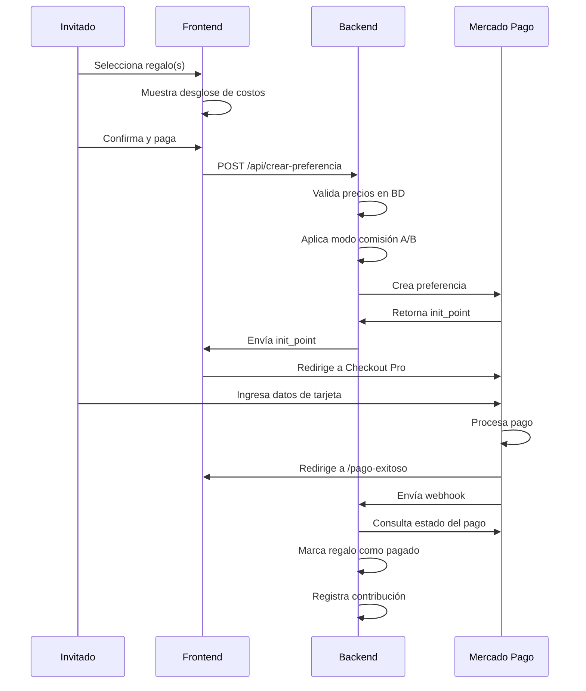

# 💳 Configuración de Mercado Pago - Mesa de Regalos

## 🔑 Credenciales Configuradas

### 🧪 Credenciales de Prueba/Desarrollo

```
Access Token: APP_USR-6032208155105752-010810-61dba3eba0dd04d9fe6834080b8e4141-3120378089
Public Key:   APP_USR-d437a4b4-5235-4190-a083-326bf35e3c9d
```

> 🧪 **Importante:** Estas son credenciales de **PRUEBA/TEST**. Los pagos NO serán reales y puedes usar tarjetas de prueba.

---

## 📋 Configuración Aplicada

### Backend (`/backend/src/`)

El Access Token ya está configurado en el `.env` y será utilizado por:

- **Creación de preferencias:** Para generar los links de pago
- **Webhook:** Para validar los pagos recibidos
- **Consultas:** Para verificar el estado de las transacciones

### Frontend

La Public Key se usará para inicializar Mercado Pago en el cliente (si es necesario mostrar el botón de pago directamente).

---

## 🔄 URLs de Retorno para Mesa de Regalos

Las siguientes URLs se configurarán en las preferencias de pago:

| Estado | URL | Descripción |
|--------|-----|-------------|
| **Éxito** | `http://localhost:5173/pago-exitoso` | Pago aprobado ✅ |
| **Error** | `http://localhost:5173/pago-fallido` | Pago rechazado ❌ |
| **Pendiente** | `http://localhost:5173/pago-pendiente` | Pago en proceso ⏳ |

En producción, cambiar a tu dominio real (ej: `https://bautizo-gemelas.com/pago-exitoso`)

---

## 🎯 Características del Checkout Pro

✅ **Cuotas automáticas:** El sistema detecta automáticamente si la tarjeta permite cuotas  
✅ **Tarjetas de crédito y débito:** Visa, Mastercard, etc.  
✅ **Seguridad:** Mercado Pago maneja los datos sensibles de las tarjetas  
✅ **Redirección automática:** Con `auto_return: 'approved'`

---

## 🧮 Cálculo de Comisiones (Mercado Pago Chile)

### Comisión Estándar
- **Base:** 3.19% + IVA
- **Efectiva:** ~3.80% (incluido IVA)

### Ejemplo en Modo A (invitado cubre comisión)
```
Regalo deseado:    $50.000
Comisión (3.80%):  $1.975
─────────────────────────────
Total a cobrar:    $51.975
Recibes neto:      $50.000 ✅
```

### Ejemplo en Modo B (organizador asume comisión)
```
Regalo:            $50.000
Cobras:            $50.000
Comisión (3.80%):  $1.900
─────────────────────────────
Recibes neto:      $48.100
```

---

## 🔐 Seguridad Implementada

✅ **Access Token en backend:** Nunca se expone al cliente  
✅ **Validación de precios:** Siempre se verifican contra la base de datos  
✅ **Webhook idempotente:** Un pago no se procesa dos veces  
✅ **Verificación de firma:** Los webhooks se validan consultando la API de MP

---

## 🧪 Testing

### Credenciales Actuales (Prueba)

✅ Ya estás usando credenciales de prueba, por lo que **todos los pagos son simulados** y no habrá cargos reales.

**Tarjetas de prueba de Mercado Pago Chile:**

| Tarjeta | Número | CVV | Vencimiento | Resultado |
|---------|--------|-----|-------------|-----------|
| VISA | 4168 8188 4444 7115 | 123 | 11/25 | ✅ Aprobada |
| Mastercard | 5416 7526 0258 2580 | 123 | 11/25 | ✅ Aprobada |
| VISA | 4509 9535 6623 3704 | 123 | 11/25 | ❌ Rechazada |

Más info: [Tarjetas de prueba](https://www.mercadopago.cl/developers/es/docs/checkout-pro/additional-content/test-cards)

### Para Producción

Con las credenciales actuales (de producción), **todos los pagos serán reales**.

--- (Cuando Estés Listo)

Cuando quieras recibir pagos reales:

1. Ve a: https://www.mercadopago.cl/developers/panel
2. Selecciona **"Credenciales de producción"**
3. Reemplaza las credenciales en `.env`
4. Las credenciales de producción también empiezan con `APP_USR-`



---

## 🚀 Próximos Pasos

1. **Etapa 2:** Crear endpoints del backend
   - `/api/crear-preferencia` - Genera links de pago
   - `/api/webhook` - Recibe notificaciones
   - `/api/regalos` - Lista pública de regalos

2. **Etapa 3:** Implementar lógica de comisión A/B

3. **Etapa 4:** Frontend con catálogo y checkout

4. **Etapa 5:** Panel admin para gestionar regalos y ver aportes

---

## 📚 Documentación Oficial

- **Mercado Pago Dev:** https://www.mercadopago.cl/developers/es
- **Checkout Pro:** https://www.mercadopago.cl/developers/es/docs/checkout-pro
- **SDK Node.js:** https://www.mercadopago.cl/developers/es/docs/sdks-library/server-side
- **Credenciales:** https://www.mercadopago.cl/developers/panel/credentials

---

## ⚠️ Recordatorios de Seguridad

🔒 **NUNCA** subas el `.env` a GitHub  
🔒 **NUNCA** pongas el Access Token en el frontend  
🔒 **SIEMPRE** valida los precios en el backend  
🔒 **SIEMPRE** verifica los webhooks consultando la API de MP

---

**Última actualización:** 28 de agosto de 2026  
**Status:** ✅ Configurado y listo para implementar
